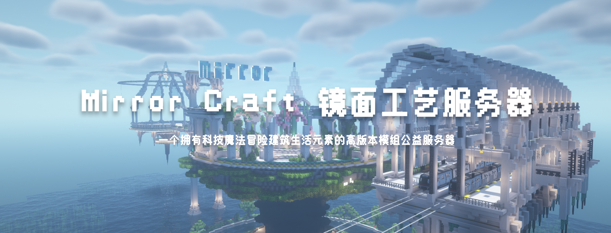

# 简介 Introduction

> 在这里你可以了解到服务器的基本信息
------

### 欢迎进入Mirror Craft镜面工艺官方WIKI(*^▽^*)

服务器模式:1.18.2公益模组服

服务器客户端在群文件与阿里云盘中，请自行下载。

为了使各位玩家能更加文明和谐的愉快游戏与交流，请将群昵称修改为游戏名称。

服务器采用外置登陆，请使用littleskin皮肤站账号登录，如有不便敬请谅解。

------

[[服务器官网](https://www.mirrorcraft.cloud)] [[服务器wiki](https://wiki.mirrorcraft.cloud)] [[KOOK频道](https://kaihei.co/1s1ZAf)] [[网盘下载](https://www.aliyundrive.com/s/mnmGxmm9tuj)]

[[B站视频](https://b23.tv/KeuXBH8)] [[B站专栏](https://www.bilibili.com/read/cv21361763)] [[MC百科](https://play.mcmod.cn/sv20186262.html)] [[我的世界中文网](https://www.minecraftzw.com/30936.html)] ~~[[MCBBS](https://www.mcbbs.net/thread-1339659-1-1.html)]~~

------

服务器模组类型有科技魔法冒险生活建筑等元素 涉及到Minecraft的方方面面

例如 机械动力 通用机械 植物魔法 应用能源 工业先锋 雕刻工艺 潘马斯等模组

服务器内容与模组都将持续更新...

------

镜面服务器欢迎你的加入~