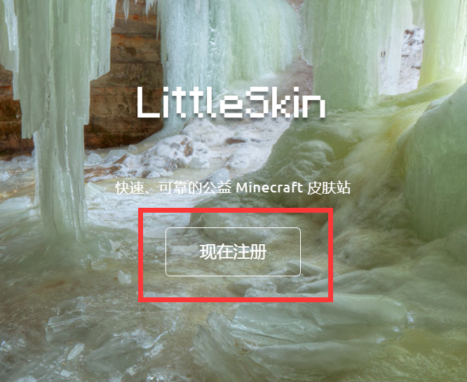
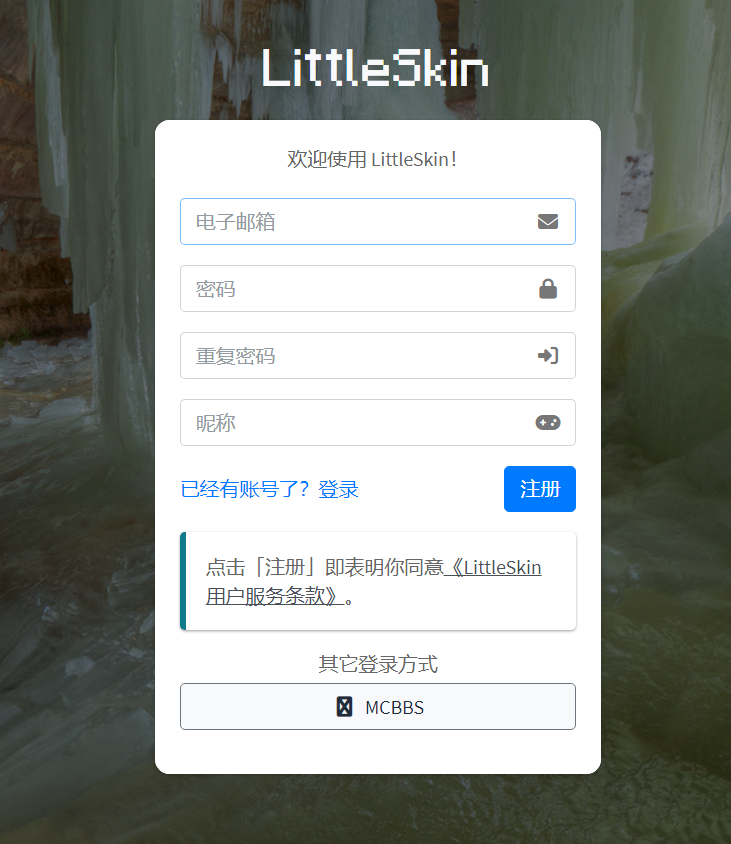
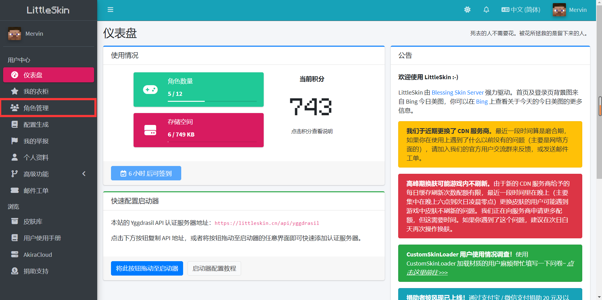
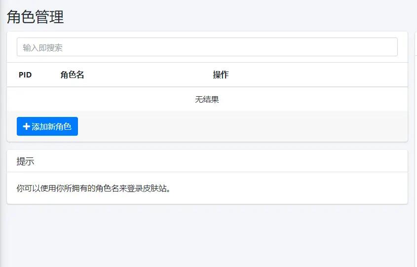
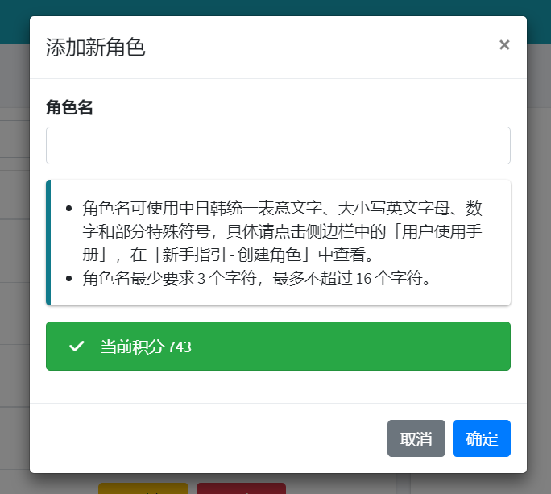
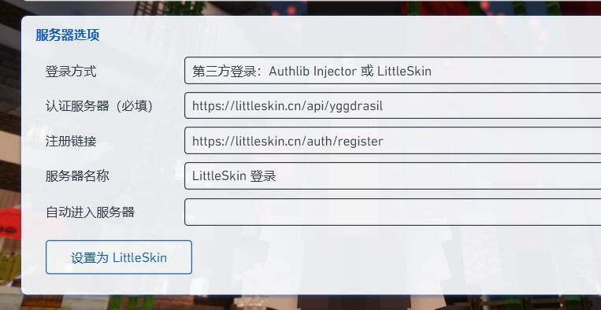

# 入服前的准备 Preparation

> 你应该知晓的进入服务器方式
------

##### 相信你看到这里，你已经对我们服务器产生了兴趣，已经想了解如何进入服务器了？

目前Mirror Craft **不设白名单**，采用外置登录的方式登录服务器，需要 在mirrorc skin注册账号并添加角色后 才可加入服务器，服务器IP由客户端自带。

!> 首先外置登录需要拥有mirrorc skin账号，已经有账号且添加角色的可以忽略这一步啦。

没有账号的朋友，我们先打开[[mirrorc skin皮肤站](https://skin.mirrorc.me/)]进入皮肤站，选择注册账号。

注意：此时注册账号这里的“昵称”是mirrorc skin皮肤站的昵称，而不是你在游戏中显示的名字。

按照注册流程注册完账号后，直接点击左边的“角色管理”

点击“添加新角色”后输入你自己的游戏名

（请注意，服务器不支持中文及部分特殊符号）

添加完角色后，就可以去左边最下面那里换上你喜欢的皮肤了~

从这里开始我们的mirrorc skin注册教程已经是完毕了，接下来教你怎么启动器里面外置登录！

首先打开我们的PLC启动器，选择版本设置后，在设置里在登录方式一栏需要选择第三方登录，再在下方选择设置为mirrorc skin即可。

###### *目前服务器并不支持正版登录，所以所有玩家均需注册mirrorc skin皮肤站账号。

------

目前Mirror Craft为 **七周目**。服务器的版本是**1.18.2。**

客户端可在QQ群文件中与阿里云盘中下载。

------

服务器除Mirror Craft主服，还有支线服务器分支供你游玩。

例如：冬季救援、E6E、贪婪、齿轮颂歌。